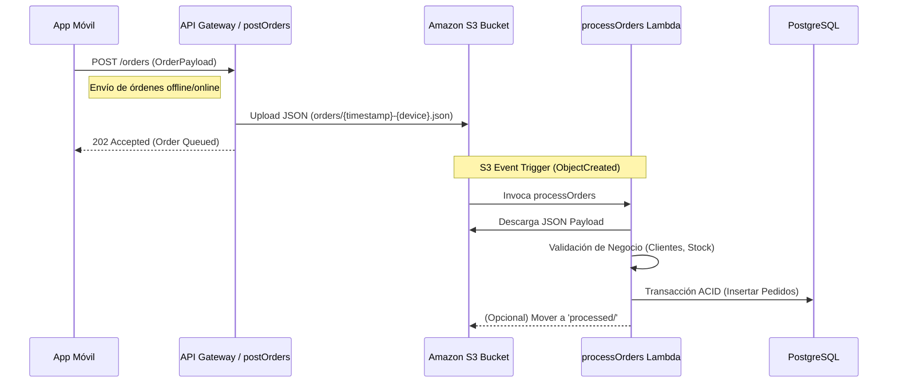

# Go Event Orders Microservice

> [!IMPORTANT]
> **Note:** This is a reduced version of a real system I designed and built, which I cannot publicly share because it belongs to my company. This repository serves as a demonstration of architecture and best practices.

______________________________________________________________________

## Overview

**Go Event Orders** is a production-grade, event-driven microservice built in **Go** that demonstrates modern backend architecture principles. It showcases how to design scalable, resilient, and maintainable systems using **Clean Architecture**, **Event-Driven Design**, and **AWS Serverless** technologies.

The system manages asynchronous order ingestion from mobile devices, ensuring high throughput, fault tolerance, and complete decoupling between producers and consumers through an elegant S3-based event bus pattern.

### Why This Architecture Matters

This project uses **separation of concerns** rather than a monolithic request-response cycle, the system splits the problem into two distinct phases:

1. **Fast Ingest** — Accept and queue orders instantly (sub-100ms response).
1. **Async Processing** — Validate business logic and persist data without blocking the client.

This pattern is battle-tested in high-scale systems and eliminates the need for traditional message queues while maintaining full event traceability and idempotent processing.

______________________________________________________________________

## Technology Stack

| Component | Technology |
|-----------|-----------|
| **Language** | Go 1.23+ |
| **Compute** | AWS Lambda (Custom Go Runtime) |
| **Storage** | Amazon S3 (Event Bus) + Amazon RDS PostgreSQL (Persistence) |
| **Infrastructure as Code** | Serverless Framework v3 |
| **ORM** | GORM |
| **Architecture Pattern** | Event-Driven + Clean Architecture |

______________________________________________________________________

## System Architecture

The system implements a **Producer-Consumer** pattern with S3 as the event bus. This design decouples the mobile client from backend processing, enabling independent scaling and fault isolation.

### Data Flow Diagram



### Processing Phases

1. **Ingest Phase** — The `POST /orders` endpoint validates the payload structurally and uploads it to S3 immediately, returning a `202 Accepted` response. The client is freed from waiting for backend processing.

1. **Event Trigger** — The S3 upload automatically triggers an event that invokes the `processOrders` Lambda function.

1. **Business Logic Phase** — The processor downloads the payload, executes domain validations (customer existence, product stock), and persists data transactionally to PostgreSQL.

______________________________________________________________________

## Project Structure

The codebase follows a modular, layered architecture that enforces separation of concerns:

```
.
├── functions/
│   ├── getClients/        # GET Endpoint (Direct Consumer)
│   ├── getProducts/       # GET Endpoint (Direct Consumer)
│   ├── postOrders/        # POST Endpoint (Event Producer)
│   ├── processOrders/     # Event Processor (Async Consumer)
│   └── status/            # Health Check Endpoint
├── internal/
│   ├── domain/            # Domain Models (Clean Types)
│   ├── dto/               # Data Transfer Objects (Request/Response)
│   ├── infrastructure/    # Infrastructure Adapters (DB, Observability, Storage)
│   ├── repository/        # Data Access Layer
│   └── shared/            # Cross-cutting Utilities
├── migrator/              # Database Schema Migrator
├── clingy/                # Interactive CLI for Lambda Testing & Deployment
├── serverless.yml         # AWS Infrastructure Definition
├── go.mod                 # Dependencies
└── readme.md              # This file
```

### Key Components

#### **`internal/domain/`** — Domain Models

Pure Go structs with zero external dependencies (annotated for GORM). These types are the single source of truth for data contracts across the entire system. No database logic, no AWS SDK calls—just clean, serializable domain objects.

**Why it matters:** Enables easy testing, clear contracts, and reusability across functions.

#### **`internal/dto/`** — Data Transfer Objects

Defines the exact structure of incoming requests and outgoing responses, ensuring that the domain models are never directly exposed or tightly coupled to the HTTP layer.

#### **`internal/infrastructure/`** — Infrastructure Adapters

Encapsulates all external integrations, such as the S3 client for publishing events, the PostgreSQL connection setup, and observability tools.

**Why it matters:** Isolates the core domain from external dependencies, making it easier to swap out technologies or mock them during testing.

#### **`internal/repository/`** — Data Access Layer

Abstracts the database operations (e.g., `orders_repo.go`, `validation_repo.go`). It provides a clean interface for the business logic to interact with persistence without knowing about GORM or SQL.

#### **`migrator/`** — Database Schema Migrator

A dedicated tool that uses GORM's AutoMigrate feature to synchronize the database schema directly from the domain models in `internal/domain/`. 

**Why it matters:** Eliminates the need for raw SQL migration files, ensuring the database structure is always perfectly aligned with the Go structs. For more details, see the [Migrator documentation](./migrator/readme.md).

#### **`postOrders/`** — Lightweight Producer

A thin HTTP handler that accepts the order payload, validates its structure, and uploads it to S3. Its single responsibility is to be fast and reliable.

**Why it matters:** Keeps the critical path short. Mobile clients get instant feedback. No database locks, no complex transactions.

#### **`processOrders/`** — Heavy Lifting Consumer

The workhorse function that handles all business complexity: validation, database transactions, error recovery, and idempotent retries.

**Why it matters:** Separates concerns. Complex logic runs asynchronously, isolated from the client request. Failures don't cascade to the mobile app.

#### **`internal/shared/`** — Cross-cutting Concerns

Shared utilities for HTTP response formatting (JSend pattern) and other common helpers.

**Why it matters:** Eliminates duplication and ensures consistent error handling across all functions.

______________________________________________________________________

## Design Patterns & Best Practices

### 1. **Clean Architecture**

The codebase strictly separates:

- **Entities** (`apitypes/`) — Domain objects, independent of frameworks.
- **Use Cases** (`postOrders/`, `processOrders/`) — Business logic orchestration.
- **Adapters** (`utils/`) — Database, HTTP, AWS integrations.

This layering makes the system testable, maintainable, and framework-agnostic.

### 2. **Event-Driven Design**

By using S3 as an event bus, the system achieves:

- **Decoupling** — Producers and consumers are completely independent.
- **Scalability** — Each component scales independently based on demand.
- **Resilience** — Failures in processing don't affect order ingestion.
- **Auditability** — Every event is persisted in S3 for compliance and debugging.

### 3. **Idempotent Processing**

The `processOrders` function is designed to be safely retried. If a Lambda invocation fails midway, re-running it produces the same result without duplicating data or side effects.

**Implementation:** Database constraints (unique keys) and transaction semantics ensure idempotency at the persistence layer.

### 4. **Structured Error Handling**

All functions return standardized HTTP responses using the **JSend pattern**:

```json
{
  "status": "success|fail|error",
  "data": { /* ... */ },
  "message": "Human-readable error description"
}
```

This ensures clients can reliably parse and handle errors.

### 5. **Security by Design**

- **Environment Variables** — All credentials (DB passwords, API keys) are injected at runtime, never hardcoded.
- **IAM Least Privilege** — Each Lambda function has minimal permissions (S3 read/write, RDS access only).
- **Input Validation** — All payloads are validated before processing.

______________________________________________________________________

## Clingy: Interactive Lambda Testing & Deployment

**Clingy** is a context-aware CLI framework purpose-built for testing and invoking AWS Lambda functions locally and remotely. It eliminates the friction of manual payload composition and deployment cycles.

### What Clingy Does

- **Composable Payloads** — Build Lambda events by mixing reusable YAML snippets instead of writing static JSON files.
- **Interactive Testing** — Invoke functions locally or remotely with a single command, with real-time feedback.
- **Automated Deployment** — Build, zip, and deploy Go functions in a single orchestrated workflow.
- **Live Monitoring** — Tail CloudWatch logs and run Insights queries directly from the CLI.
- **Environment Awareness** — Automatically switch between dev/staging/prod configurations.

### Why It Matters

Traditional Lambda development involves:

1. Write code → 2. Compile → 3. Zip → 4. Deploy → 5. Invoke via AWS Console → 6. Check logs in CloudWatch

Clingy collapses this into a single interactive flow, reducing iteration time from minutes to seconds. The composable payload system means you can test complex scenarios (auth headers, nested bodies, query parameters) without manually editing JSON files.

For more details, see the [Clingy documentation](./clingy/README.md).

### Demo & Visualization

> 
>
> Shows the build, zip and deploy workflow with clingy.

> 
>
> Shows the invoke workflow.

> 
>
> Shows the post orders workflow.


## Author

[@ncasatti](https://github.com/ncasatti)
